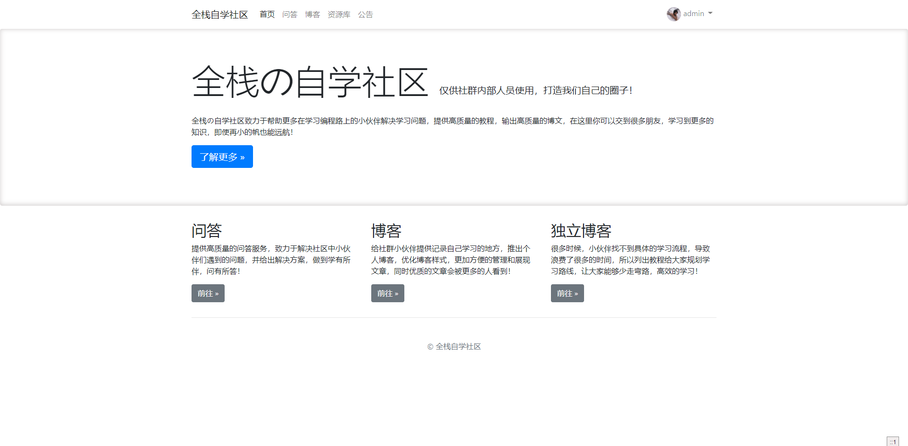

# 模仿狂神小社区的项目
## 全栈自学社区bbs


### 介绍
这是小狂神的开源社区 模仿并且制作


本次项目主要已练习与巩固知识为主  
### 项目主要的依赖
### 后端
SpringBoot 2.3.5

MySQL 8.x

MyBatisPlus 3.0.5

fastjson

springsecurity

druid


### 前端

editormd

bootstrap

vue

vue-element

### 模板引擎
thymeleaf

### 目录说明
```shell script
src/main/java/com/codingce
- config        配置类
- controller    controller
- generator     代码生成器
- mapper        mapper
- pojo          pojo
- result        统一返回结果
- service       service
- utils         工具类
- vo            vo对象
CodingceApplication   启动类

src/resources
- static        静态资源
- templates     页面模板
- application-dev.properties   配置文件

codingcestudy.sql   数据库文件
```

### 如何加入全栈自学小社区
关注  全栈自学社区 公众号

### 感谢小狂神